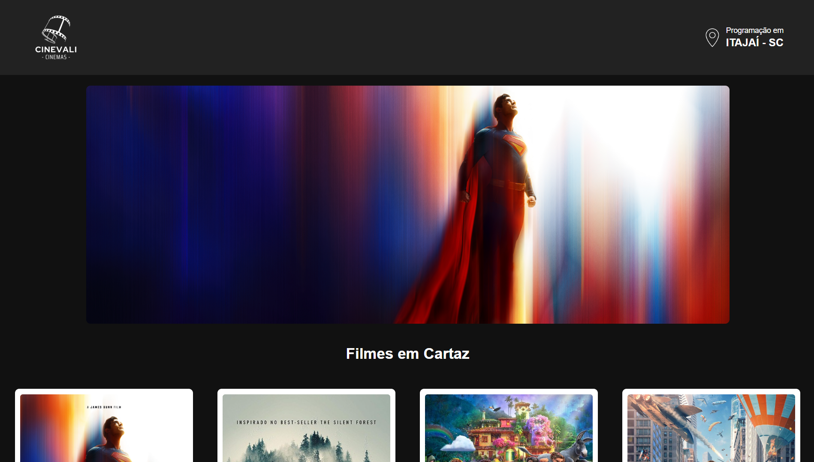

<h1 align="center">🎬 CineVali</h1>

Projeto fictício de site para uma rede de cinemas, desenvolvido como atividade de front-end na disciplina de Programação Web.

  <a href="#-tecnologias">Tecnologias</a>&nbsp;&nbsp;|&nbsp;&nbsp;
  <a href="#-projeto">Projeto</a>&nbsp;&nbsp;|&nbsp;&nbsp;
  <a href="#-melhorias-futuras">Melhorias Futuras</a>

## 🚀 Tecnologias

Este projeto foi desenvolvido com:

- HTML  
- CSS  
- JavaScript  

## 💻 Projeto

O **CineVali** simula um sistema de site para cinemas, com páginas como seleção de assentos, combos de pipoca, pagamento e revisão. 

🖥️ Foco na estrutura, layout visual e usabilidade para desktop.  
📄 Projeto totalmente estático (sem integração com back-end).  

🌐 Acesse o projeto finalizado, online, através do [link](https://cinevali.vercel.app/).

## 🔧 Melhorias Futuras

- [ ] Adição de **media queries** para tornar o layout responsivo em dispositivos móveis.  
- [ ] Pequenas melhorias visuais em alguns componentes.
- [ ] Integração com back-end e banco de dados.

⚠️ *Projeto funcional e visualmente completo para telas maiores, mas ainda não responsivo para celulares e tablets. Pretendo corrigir isso em breve.*  

## 📸 Preview

  

 

Feito com 💙 por <strong>Vitor Hugo</strong>

